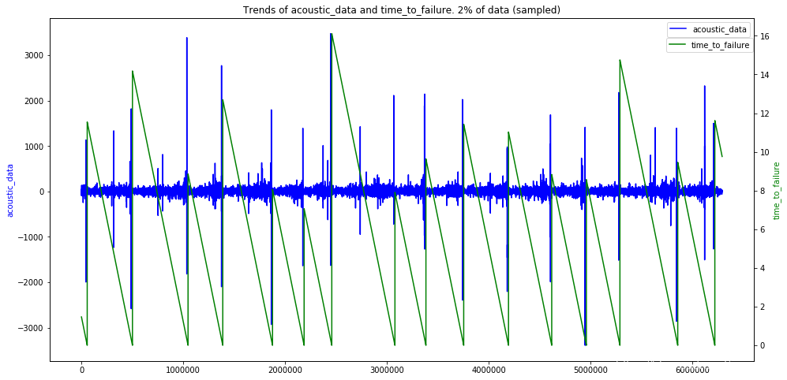
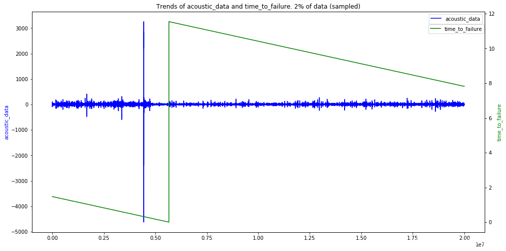
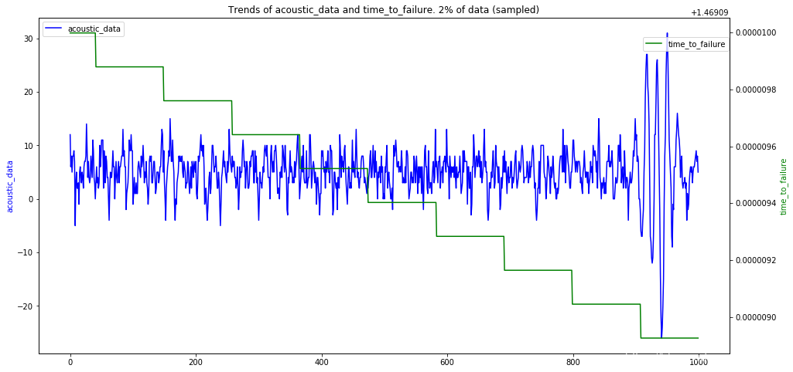

## Training Data

Rows：6 2914 5480

Columns：2（acoustic_data，time_to_failure）

There is no `null` value.

There are `16` earthquake.

## Test Data

Files：2624

Rows：15 0000（Training Data can be divided into 4194 segments）

